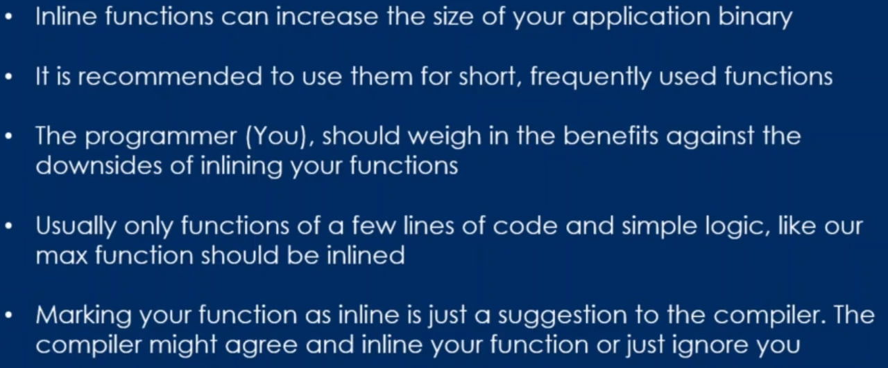
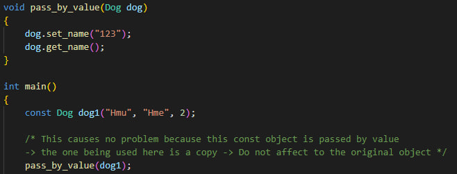

# CPP

## 7. Diving In

### C++ Program Execution Model & Memory Model


## 9. Operations on Data

### Weird Integral Types

```
    short int x = 10;
    short int y = 20;
    auto z = x + y; // z will be integer because int is the smallest type for which we can support these arithmetic operations.
    std::cout << z;
```

## 10. Literals and Constants

## 13. Variable Lifetime and Scope

## 17. Pointers

### Pointer to char

```
char *str = "Hello";
str[0] = 'x'; // Not work because str here is pointed to a constant string => can not modify.
str = "Halo"' // It's work because str just point to another address, don't modify "Hello" string.
```

### Const pointer and pointer to const

#### Pointer to const:

```
int a = 5, b = 7;
const int *pa = &a; // pa here is a pointer to constant.
*pa = 10; // Not work, can not modify a through pa.
pa = &b; // It's work because a pointer to const can pointer to another variable.
```

#### Const pointer:

```
int a = 5, b = 6;
int *const pa = &a; // pa is a const pointer
pa = &b; // A const pointer can not point to another variable.
*pa = 7; // But a const pointer can modify value of a through pa.

```

#### Const pointer to const: Can not change either the pointer or the data in the pointer

```
int a = 5, b = 6;
const int *const pa = &a; // pa here is a const pointer to const.
pa = &b; // pa can not point to another variable.
*pa = 10; // Can not modify the value of a through pa.
```

#### NOTE

1. Can not set up a modifiable pointer to const data.

```
const int a = 4;
int *pa = &a; // Error: pa is a modifiable pointer. So, it can not point to a const variable.
const int *pa = &a; // work
const int *const pa = &a; // work
```

### Array of const pointer to const char

```
const char *students[] {
    "nguyen van a",
    "nguyen van b",
    "nguyen van c",
}; /* students is an array of const char. So each element of this array is a pointer to const */

// *students[0] = 'X'; // Not work
students[0] = "nguyen van x"; // work
```

### Dynamic Memory Allocation

```
RULES:
1. Don't try to use a pointer that didn't initialize.
2. Don't try to work with a pointer that is pointing to null.
```


### Dangling Pointer

```
1. Uninitialized Pointer.
    Use Pointer before initialize => crash.
    -> Initialize pointer after using.
2. Deleted Pointer.
    Use Pointer after delete => crash.
    -> Reset pointer to null after delete.
3. Multiple Pointers pointing to same memory.
    int *pa = new int (83);
    int *pb = pa;
    std::cout << *pb; // work
    delete pa;
    std::cout << *pb; // not work
    After delete pa, pb currently points to deleted memory => crash.
    -> If using multiple pointers to the same address, make sure the owner pointer is very clear.
```

## 18. References

### Declaring and using references

```
1. The references can be use like the original variables.
    int a {5};
    int &ra = a;
    std::cout << (ra == a); // true
    std::cout << (&ra == &a); // true
    std::cout << (sizeof(int) == sizeof(int&)); // true
```

#### NOTE

```
1. Modify the value of the reference will reflect the value of the original variable.
2. Modify the value of the original variable will reflect the value of the reference.
3. The Reference is alias to the variable. It can be use pretty much the same way of using variable.
```

### Comparing pointers and references


```
int a = 5, b = 10;
int &ra = a;
ra = b; // ra here is not reference the variable b. ra is still reference the variable a.
```

```
int &ra; // Error, because reference must be initialized at declaration
```

```
References behave like constant pointers, because they can not reference another variable.
But they don't require dereferencing to read and write like constant pointers.
```

### References and const

1. Const Reference

```
int a = 5;
const int &ra = a;
ra = 10; // Error. Can not modify the original variable through reference in this case.

```

```
The Reference by default is just like a constant pointer. (&a ~ int *const pa).
=> const int &a ~ const int *const pa.
Const applies to reference variable name, not to the original variable.
    int a = 5;
    const int &ra = a;
    ra = 10; // Error.
    a = 10; // Work
```

## 20. Functions

### Pass by value

```
- Not recommended for relatively large types (user defined).
- Make copies: Can waste memory if the parameter is large type.
```

### Pass by reference

```
- Does not make copies.
- Change the parameter are reflected the original variable.
- Saves memory.
- Recommended for passing around large types (ex: user defined)

```

### Pass by pointer

```
- Can go through dereferencing the parameter and make the changes reflected outside the scope of the function.
- Avoid copies (a pointer is very cheap to copy).
- Recommended for passing around large types (user defined).
```

### Implicit conversions with references

### Implicit conversions with pointers

## 23. Getting things out of functions

### Return by value


```
- If a function return by value like std::string. Suppose the string is returned has 1000 characters inside.
=> Copying this string would be a waste. So, the compiler will do some magic, compiler is not going to return
by value. It's going to do some kind of return by reference (not really return by reference).
```

### Return by reference


#### References to local variables


```
Local variables are destroyed when the function terminates or finishes executing. So, trying to use the reference
to theses local variable to do anything with the data that is referenced (ex: modifying) will cause undefined
behavior (crash) because the function and its memory are going to be destroyed, they are no longer exist.
```

### Return by pointer

#### Pointers to local variables


```
This problem is the same with references to local variable.
```

### Type deduction

```

```

## 24. Function overloading

```
Function overloading is a mechanism in C++ to have multiple copies of the same function but taking different parameters.
```

## 25. Lambda Functions

### Declaring and using lambda functions


```
A mechanism to set up anonymous functions (without names). Once, they can be given a name and can be called or can be used
to do things directly.
```

### Capture Lists

```
- If capture Lists is empty, the lambda function can only use the things inside it. So, using capture lists help the
lambda function can access to things that are declared or defined outside the lambda function.
- Capture by value is the same with pass by value, a variable inside the lambda function is a copy version of the outside.
- The outside variable that the lambda function use inside it can not be modified (in case of capture by value).
```


### Capture all in context


```
Use "=" in capture lists to capture everything by value.
Use "&" in capture lists to capture everything by reference.

```

## 26. Functions: The misfits

### Static variables

```
Both global and static variables have static storage duration. They live throughout the entire lifetime of the program.

Static variables are scoped to the function in which they are declared and used. Trying to access them outside that
function will get a compiler error.

Global variables are scoped to the global scope of the file where they are declared. They are accessible and usable
through out the entire file.
```

#### Global variables

```
A global variable is initialized when the program is starting, it's even initialized before the main function runs.
Its lifetime is going to start when the application starts and it's going to be destroyed when the application is killed.
```

#### Static variables


```
Static variables is the same with global variables but its scope is going to be limited to the function where it is
declared. So, can not use static variable outside.
```

#### Difference between the scope and the lifetime of variables

```
The scope is within a curly braces in the function where the variable is declared.
The lifetime of variables is not tied to the curly braces. It's going to live throughout the entire lifetime of application.
```

### Inline functions



## 28. Function Templates

### Trying out function templates


```
- Function templates are a mechanism in C++ to avoid code repetition.
- Compiler will take the function template and this function is going to be replace its type to the type of the parameter that
is passed into the function. Once, compiler generates the real C++ code about the function after do a replacement.
- The function templates is forced to use the same type for the return type, all parameter type.
```


### Template type deduction and explicit argument


```
Template type deduction is a mechanism that the compiler uses to deduce the type it would use to set up the template instance
from the arguments that is passed to the function call.
```

### Template parameter by reference

```
Like pass by reference. Modifying a parameter in template function will reflect the value of the original variable.
```

### Template specialization


```

```

## 30. Class

### C++ Class


```
Members of class are public by DEFAULT -> can use "public" keyword to public members.
If the members are private => It will not be usable outside the class, it can only be accessed inside of the class.
```


### C++ Constructors

```
Constructors are special kind of method that is called when an instance of a class is created.
No return type.
Same name as the class.
Can have parameters. Can also have empty parameter list.
Usually used to initialize member variables of a class.
It must be in the public scope of the class. If it isn't public, it can not be accessed from the outside.
If a class don't have a constructor, compiler is going to generate an empty constructor. This empty constructor
is going to take no parameters and it's not going to have anything in the body.
```


### Default constructor

```

```

### Setters and Getters

```
Use to read or modify the members variable of a class.
This functions live in the public scope of a class. 
```


### Class across multiple file

```
Eg: Cylinder::volume()
"::" is called the Scope Resolution Operator. It's telling the compiler that the function called volume() 
lives in the scope of Cylinder class.
```

### Arrow pointer call notation


### Destructors


```
Destructors are special functions or methods of a class that are called by compiler to destroy the object.
They are called when the object dies and they are needed when the object needs to release some dynamic
memory or some kind of clean up.
Destructor is always have no parameters.
```


#### NOTE
```
BE CAREFUL WHEN PASS A CLASS BY VALUE.
```

### Constructor and Destructor call order


```
The Constructor are going to be called in order.
The Destructor are going to be called in reverse order.
```

### The "this" pointer


```
The this keyword used to get the address of the current object for which a specific method or function 
is being called.
```


#### Chained calls using pointers


#### Chained calls using reference


### Struct

```
The other way to create a class is using struct.
The only difference between struct and classes is that for class, members are going to be private by default.
With struct, can use "private" keyword to make the members of struct private -> can not access them outside 
of the struct.
```


### Size of class object

```
The size of the class object is going to be the sum of the sizes its member variables. The functions are not
going to be counted, they are just helper functions that live somewhere in memory but they're not going to be 
counted in the size of object. 
```

## 31. Classes, Objects and const

### Const object

```
A const object means that its member variable can not be changed.
There is no way to let compiler know what the setters or getters do, do they modify the value of member variable.
```


#### What happen if a const object is modified or read through pointers or references?

```
That's not going to work either.
```


### Const object as function argument

#### Pass by value



#### Pass by non const reference


#### Pass by const reference


#### Pass by pointer (to non const)


#### Pass by value (to const)


#### Summary

```
- Const object is almost going to be useless:
+ Can not read from it
+ Can not write data to it
```

### Const member function


```
- A const object can't be modified, this is really clearly. But, it can't be read too because 
the compiler doesn't know whether the function call modify the const object. So, in order to 
read data from a const object, we need to tell the compiler that some functions are never going
to be modifying the const object => Marking these functions as const member function
```


```
- It's possible to overload const member function.
- Inside a const member function, modifying anything will cause compiler error.
```

### Getters that work as Setters

```

``` 

### Dangling pointers and references in objects

```
- A pointer or reference is said to be dangling pointer if it's pointing to or referencing invalid data. 
- Example: a pointer is pointing to a deleted piece of memory.
```

#### Dangling reference


#### Dangling pointer


### Zooming in on cost


### Mutable member variable


### Structured Bindings


## 32. Diving deep into Constructors and Initialization

### Default parameters for constructors

```
Like default parameters in JS.
```

#### NOTE


### Initializer lists for constructors


```
- Initializer lists avoid unnecessary copies.
- In some cases, they're the only way to initialize an object.
```

### Initializer lists vs Member wise copy initialization


### Explicit constructors


### Constructor Delegation

```
Constructor delegation is a concept where one constructor of a class calls another constructor 
from the same class.
```


### Copy constructors


#### NOTE


```
- Do not pass by value when implementing a copy constructor, this action will cause endless copy
constructor call.
```

#### Implement a copy constructor


#### Solve problem


### Objects stored in arrays are copies

```
- Putting objects in an array is going to create copies.
```


#### Prove


### Deep copy and shallow copy


#### Shallow


#### Deep


### Move constructors

```

```
