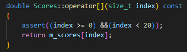
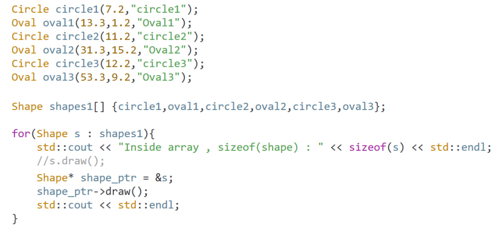

# CPP

## 7. Diving In

### C++ Program Execution Model & Memory Model


## 9. Operations on Data

### Weird Integral Types

```
    short int x = 10;
    short int y = 20;
    auto z = x + y; // z will be integer because int is the smallest type for which we can support these arithmetic operations.
    std::cout << z;
```

## 10. Literals and Constants

## 13. Variable Lifetime and Scope

## 17. Pointers

### Pointer to char

```
char *str = "Hello";
str[0] = 'x'; // Not work because str here is pointed to a constant string => can not modify.
str = "Halo"' // It's work because str just point to another address, don't modify "Hello" string.
```

### Const pointer and pointer to const

#### Pointer to const:

```
int a = 5, b = 7;
const int *pa = &a; // pa here is a pointer to constant.
*pa = 10; // Not work, can not modify a through pa.
pa = &b; // It's work because a pointer to const can pointer to another variable.
```

#### Const pointer:

```
int a = 5, b = 6;
int *const pa = &a; // pa is a const pointer
pa = &b; // A const pointer can not point to another variable.
*pa = 7; // But a const pointer can modify value of a through pa.

```

#### Const pointer to const: Can not change either the pointer or the data in the pointer

```
int a = 5, b = 6;
const int *const pa = &a; // pa here is a const pointer to const.
pa = &b; // pa can not point to another variable.
*pa = 10; // Can not modify the value of a through pa.
```

#### NOTE

1. Can not set up a modifiable pointer to const data.

```
const int a = 4;
int *pa = &a; // Error: pa is a modifiable pointer. So, it can not point to a const variable.
const int *pa = &a; // work
const int *const pa = &a; // work
```

### Array of const pointer to const char

```
const char *students[] {
    "nguyen van a",
    "nguyen van b",
    "nguyen van c",
}; /* students is an array of const char. So each element of this array is a pointer to const */

// *students[0] = 'X'; // Not work
students[0] = "nguyen van x"; // work
```

### Dynamic Memory Allocation

```
RULES:
1. Don't try to use a pointer that didn't initialize.
2. Don't try to work with a pointer that is pointing to null.
```


### Dangling Pointer

```
1. Uninitialized Pointer.
    Use Pointer before initialize => crash.
    -> Initialize pointer after using.
2. Deleted Pointer.
    Use Pointer after delete => crash.
    -> Reset pointer to null after delete.
3. Multiple Pointers pointing to same memory.
    int *pa = new int (83);
    int *pb = pa;
    std::cout << *pb; // work
    delete pa;
    std::cout << *pb; // not work
    After delete pa, pb currently points to deleted memory => crash.
    -> If using multiple pointers to the same address, make sure the owner pointer is very clear.
```

## 18. References

### Declaring and using references

```
1. The references can be use like the original variables.
    int a {5};
    int &ra = a;
    std::cout << (ra == a); // true
    std::cout << (&ra == &a); // true
    std::cout << (sizeof(int) == sizeof(int&)); // true
```

#### NOTE

```
1. Modify the value of the reference will reflect the value of the original variable.
2. Modify the value of the original variable will reflect the value of the reference.
3. The Reference is alias to the variable. It can be use pretty much the same way of using variable.
```

### Comparing pointers and references


```
int a = 5, b = 10;
int &ra = a;
ra = b; // ra here is not reference the variable b. ra is still reference the variable a.
```

```
int &ra; // Error, because reference must be initialized at declaration
```

```
References behave like constant pointers, because they can not reference another variable.
But they don't require dereferencing to read and write like constant pointers.
```

### References and const

1. Const Reference

```
int a = 5;
const int &ra = a;
ra = 10; // Error. Can not modify the original variable through reference in this case.

```

```
The Reference by default is just like a constant pointer. (&a ~ int *const pa).
=> const int &a ~ const int *const pa.
Const applies to reference variable name, not to the original variable.
    int a = 5;
    const int &ra = a;
    ra = 10; // Error.
    a = 10; // Work
```

## 20. Functions

### Pass by value

```
- Not recommended for relatively large types (user defined).
- Make copies: Can waste memory if the parameter is large type.
```

### Pass by reference

```
- Does not make copies.
- Change the parameter are reflected the original variable.
- Saves memory.
- Recommended for passing around large types (ex: user defined)

```

### Pass by pointer

```
- Can go through dereferencing the parameter and make the changes reflected outside the scope of the function.
- Avoid copies (a pointer is very cheap to copy).
- Recommended for passing around large types (user defined).
```

### Implicit conversions with references

### Implicit conversions with pointers

## 23. Getting things out of functions

### Return by value


```
- If a function return by value like std::string. Suppose the string is returned has 1000 characters inside.
=> Copying this string would be a waste. So, the compiler will do some magic, compiler is not going to return
by value. It's going to do some kind of return by reference (not really return by reference).
```

### Return by reference


#### References to local variables


```
Local variables are destroyed when the function terminates or finishes executing. So, trying to use the reference
to theses local variable to do anything with the data that is referenced (ex: modifying) will cause undefined
behavior (crash) because the function and its memory are going to be destroyed, they are no longer exist.
```

### Return by pointer

#### Pointers to local variables


```
This problem is the same with references to local variable.
```

### Type deduction

```

```

## 24. Function overloading

```
Function overloading is a mechanism in C++ to have multiple copies of the same function but taking different parameters.
```

## 25. Lambda Functions

### Declaring and using lambda functions


```
A mechanism to set up anonymous functions (without names). Once, they can be given a name and can be called or can be used
to do things directly.
```

### Capture Lists

```
- If capture Lists is empty, the lambda function can only use the things inside it. So, using capture lists help the
lambda function can access to things that are declared or defined outside the lambda function.
- Capture by value is the same with pass by value, a variable inside the lambda function is a copy version of the outside.
- The outside variable that the lambda function use inside it can not be modified (in case of capture by value).
```


### Capture all in context


```
- Use "=" in capture lists to capture everything by value.
- Use "&" in capture lists to capture everything by reference.

```

## 26. Functions: The misfits

### Static variables

```
- Both global and static variables have static storage duration. They live throughout the entire lifetime of the program.
- Static local variables are not destroyed when a function returns. 
- Static variables are scoped to the function in which they are declared and used. Trying to access them outside that
function will get a compiler error.
- Global variables are scoped to the global scope of the file where they are declared. They are accessible and usable
through out the entire file.
```

#### Global variables

```
- A global variable is initialized when the program is starting, it's even initialized before the main function runs.
- Its lifetime is going to start when the application starts and it's going to be destroyed when the application is killed.
```

#### Static variables


```
- Static variables is the same with global variables but its scope is going to be limited to the function where it is
declared. So, can not use static variable outside.
```

#### Difference between the scope and the lifetime of variables

```
- The scope is within a curly braces in the function where the variable is declared.
- The lifetime of variables is not tied to the curly braces. It's going to live throughout the entire lifetime of application.
```

### Inline functions


## 28. Function Templates

### Trying out function templates


```
- Function templates are a mechanism in C++ to avoid code repetition.
- Compiler will take the function template and this function is going to be replace its type to the type of the parameter that
is passed into the function. Once, compiler generates the real C++ code about the function after do a replacement.
- The function templates is forced to use the same type for the return type, all parameter type.
```


### Template type deduction and explicit argument


```
Template type deduction is a mechanism that the compiler uses to deduce the type it would use to set up the template instance
from the arguments that is passed to the function call.
```

### Template parameter by reference

```
Like pass by reference. Modifying a parameter in template function will reflect the value of the original variable.
```

### Template specialization


```
- Pending ...
```

## 30. Class

### C++ Class


```
Members of class are public by DEFAULT -> can use "public" keyword to public members.
If the members are private => It will not be usable outside the class, it can only be accessed inside of the class.
```


### C++ Constructors

```
Constructors are special kind of method that is called when an instance of a class is created.
No return type.
Same name as the class.
Can have parameters. Can also have empty parameter list.
Usually used to initialize member variables of a class.
It must be in the public scope of the class. If it isn't public, it can not be accessed from the outside.
If a class don't have a constructor, compiler is going to generate an empty constructor. This empty constructor
is going to take no parameters and it's not going to have anything in the body.
```


### Default constructor

```

```

### Setters and Getters

```
Use to read or modify the members variable of a class.
This functions live in the public scope of a class. 
```


### Class across multiple file

```
Eg: Cylinder::volume()
"::" is called the Scope Resolution Operator. It's telling the compiler that the function called volume() 
lives in the scope of Cylinder class.
```

### Arrow pointer call notation


### Destructors


```
Destructors are special functions or methods of a class that are called by compiler to destroy the object.
They are called when the object dies and they are needed when the object needs to release some dynamic
memory or some kind of clean up.
Destructor is always have no parameters.
```


#### NOTE
```
BE CAREFUL WHEN PASS A CLASS BY VALUE.
```

### Constructor and Destructor call order


```
The Constructor are going to be called in order.
The Destructor are going to be called in reverse order.
```

### The "this" pointer


```
The this keyword used to get the address of the current object for which a specific method or function 
is being called.
```


#### Chained calls using pointers


#### Chained calls using reference


### Struct

```
The other way to create a class is using struct.
The only difference between struct and classes is that for class, members are going to be private by default.
With struct, can use "private" keyword to make the members of struct private -> can not access them outside 
of the struct.
```


### Size of class object

```
The size of the class object is going to be the sum of the sizes its member variables. The functions are not
going to be counted, they are just helper functions that live somewhere in memory but they're not going to be 
counted in the size of object. 
```

## 31. Classes, Objects and const

### Const object

```
A const object means that its member variable can not be changed.
There is no way to let compiler know what the setters or getters do, do they modify the value of member variable.
```


#### What happen if a const object is modified or read through pointers or references?

```
That's not going to work either.
```


### Const object as function argument

#### Pass by value


#### Pass by non const reference


#### Pass by const reference


#### Pass by pointer (to non const)


#### Pass by pointer (to const)


#### Summary

```
- Const object is almost going to be useless:
+ Can not read from it
+ Can not write data to it
```

### Const member function


```
- A const object can't be modified, this is really clearly. But, it can't be read too because 
the compiler doesn't know whether the function call modify the const object. So, in order to 
read data from a const object, we need to tell the compiler that some functions are never going
to be modifying the const object => Marking these functions as const member function
```


```
- It's possible to overload const member function.
- Inside a const member function, modifying anything will cause compiler error.
```

### Getters that work as Setters

```

``` 

### Dangling pointers and references in objects

```
- A pointer or reference is said to be dangling pointer if it's pointing to or referencing invalid data. 
- Example: a pointer is pointing to a deleted piece of memory.
```

#### Dangling reference


#### Dangling pointer


### Zooming in on cost


### Mutable member variable


### Structured Bindings


## 32. Diving deep into Constructors and Initialization

### Default parameters for constructors

```
Like default parameters in JS.
```

#### NOTE


### Initializer lists for constructors


```
- Initializer lists avoid unnecessary copies.
- In some cases, they're the only way to initialize an object.
```

### Initializer lists vs Member wise copy initialization


### Explicit constructors


```
- Explicit constructor tell the compiler that never let this constructor use implicit conversions.
```

### Constructor Delegation

```
Constructor delegation is a concept where one constructor of a class calls another constructor 
from the same class.
```


### Copy constructors


#### NOTE


```
- Do not pass by value when implementing a copy constructor, this action will cause endless copy
constructor call.
```

#### Implement a copy constructor


#### Solve problem


### Objects stored in arrays are copies

```
- Putting objects in an array is going to create copies.
```


#### Prove


### Deep copy and shallow copy


#### Shallow


#### Deep


### Move constructors

```
- Move constructor is a special kind of constructor whose job is steal data from temporary object.
```


#### Don't use move constructor


```
- If we don't use move constructor, the copy constructor will be called and it can do a lot of work 
like allocating new memory or copying data...
This is really attractive if the member variables are pointing to something really big.

- Result:
Point constructed at: 0x9e3a3ff6f0
Copy constructor called for: 0x9e3a3ff6e0
```

#### Use move constructor


```
- Move constructor use "&&"
- If we use move constructor, we will avoid a lot of work. We just stealing data from temporary object
what is going to be thrown away by the compiler and we not allocating or copying something.

- Result:
Point constructed at: 0xae303ffa30
Move constructor called
```

### Deleted Constructors

```

```

### Initializer list constructors

```

```

### Aggregate Initialization

```

```

### Designated Initializer

```

```

### Uniform Initializer for Aggregates

```

```

## 33. Friends

### Friend functions


```
- Friend functions are facility to let external functions have access to private member variable of
our own.
```


#### NOTE

```
- The friend function is first declared and alive somewhere.
- The implementation can live in any translation unit. Sure that it will be found in link stage.
- The declaration has to show up before using the function.
- The class determines who is its friends (through friend declaration, must be inside the class).
- The friend declaration can appear in public or private section of the class, either works the same.
- Can have multiple friend functions in the class. 
- Friend functions can be overload.
- Have to be use the obj_name.member_var syntax in the friend function because the friend functions
are not the member of the class, so they can not access directly.
- Friend functions don't have access to the this pointer.
```

### Friend class


```
- Friend classes are facility to give external classes access to other class member variable.
- Friend classes can read or even modify the member variables even though they are public or private.
- Just like friend functions, friend classes are not really member so they don't have directly access
to the "this" pointer.
```


## 34. Static Members

### Static member variables

```
- Static members is member variables that not tied to any object of the class. They live in the context
of object blueprints. They are created even before a single class object has been created.
- They are variables that are attached to the class itself and they are not attached to any object of class.
```


#### NOTE

```
- Static variable doesn't belong to any object, we can modify our static variable if we want in any const
member function. The const keyword after a member function is going to prevent you from modifying any member
variable in the object but the static variable is not associated to any object, it belongs to the class, so 
the const member function does not protect it.
```


```
- Non integral static member variables, be it const or non const can't be in-class initialized. 
```


## 35. Namespaces

### Creating Namespaces


```
- Sometimes you want to have different definitions for the same function.
- Example: you have 2 functions with the same name and parameters but they have the different 
implementation. This will cause compiler error -> Namespaces is facility to do this.
```


### Namespaces across multiple files

```
- Multiple namespaces with the same name (even in another file) are considered one.
```

### Default global namespaces

```
- Anything outside any namespaces is said to lie in the default global namespace.
- Call a function outside the namespace inside the namespace can use "::" operator. 
```


### Built in Namespaces

```
- An example built in namespace is "std".
```

### Using declarations

```
- This is a facility in C++ to be able to call things that live inside a namespace without explicitly specifying the
namespace name. (std::cout -> cout: bringing entire namespace)
```

### Anonymous Namespaces

```
- When the compilers sees an anonymous namespace declaration, it will generate an internal name for the namespace
- The generated unique namespace name is not accessible to the developer.
- There can only be use anonymous namespace for a single translation unit. If the developer set up multiple anonymous
namespaces blocks, they'll just be extensions to the first one.
- Anonymous namespaces in different translation units are completely separate though, the compiler generates different
unique namespace names for them behind the scenes.
- Because the developers don't have access to the compiler generated namespace name for anonymous namespaces, names
declared inside anonymous namespaces are only reachable in the translation unit where they declare.
```


```
- Even though the compiler will generate an internal name for the anonymous namespace, the contents of the anonymous 
namespace are still available and usable from the global namespace without any namespace prefix. 
```


```
- ::add(1,2) instructs the compiler to look for the function in the global namespace. It won't find one defined 
explicitly. But the compiler doesn't give up that easily. It'll find one buried under an anonymous namespace. Knowing 
that content from anonymous namespaces should be accessible from the global namespace, it'll pick that up and use it.
```


```
- ::add(1,2) instructs the compiler to look for the function in the global namespace and it'll find the one that just adds 
a and b. The one in the anonymous namespace is really buried under a namespace whose name is maintained by the compiler. 
The compiler prefers the function explicitly defined in the global namespace. 
```

### Nested Namespaces (Namespace inside other namespace)

```
- Inner namespace can directly access the outer variable without specifying the outer namespace name.
Outer can not directly access to the inner variable, it must access through Inner namespace name.
```

### Namespace Aliases


```
- This is a facility in C++ to set up a reasonable names for namespaces.
- Example: There are 20 nested namespaces. So, accessing the deepest namespace is fucking crazy. Alias will solve this problem. 

```

## 36. Program with multiple files

### One Definition Rule

```
- A source file together with all the headers and source files included via the preprocessing directive #include is known as a 
preprocessing translation unit. After preprocessing, a preprocessing translation unit is called a translation unit.
```

### Linkage

#### No linkage

```
- Function local variables have no linkage
```


#### Internal linkage

```
- Const global variables have internal linkage by default.
```


#### External linkage

```
- The "extern" keyword mean that the external variable can be accessed from other translation unit.
- Functions are external linkage by default -> may or may not be needed to mark them as external. 
```


### Flipping Linkage

```
- Change an internal linkage to external linkage by adding the "extern" keyword.
- Change an external linkage to internal linkage by adding the "static" keyword or wrapping that in
anonymous namespace.

```

### Inline variables and functions

```
- Suppose you have a utility file header, there is a variable and a function inside it and we want to
include this header file in multiple file. But, including header is just going to copy the contents of 
the header. If we did this without using "inline" keyword, we would violating "one definition rule" 
because this function and variable, the definitions for them would be showing up in multiple translation
unit. So, this behavior can cause an error: "multiple definition".
```


```
- The solution for this problem is "inline".
```


### Inline vs Static (Anonymous namespace)

```
- Inline will optimize all the definitions for a name into one but marking your things for 
internal linkage.
- Static or anonymous namespaces won't do such optimizations.
```

### Forward Declaration 

```
- Suppose that we have a farm.h (contain farm class) and dog.h (contain dog class) file. In farm.h 
we use dog class, so obviously we need to include dog.h header file in farm.h otherwise we're going
to get a compiler error. But, this behavior is going to waste a lot of compilation time.
- Example: we have the farm.h header file included in other headers. If the dog implementation changes,
but the farm header file is including the dog header file, so it will be recompiled and if the farm
header file is included in 500 other headers, all of them are going to be recompiled
-> This turned out to be a problem.
-> Cpp solve this problem by a facility "Forward Declaration"
```


```
- By using "Forward Declaration", this is basically tell the compiler: "If you see this name, don't 
freak out, you're going to see a definition for this later when you actually need to use the dog. At
this time, you don't use so don't give me a problem."
```

#### NOTE

```
- Forward Declaration won't always work because it is really not giving us all information we need to use
a dog object.
```


## 37. Operator Overloading

### Addition Operator as Member

```
- Operator overloading is the mechanism in CPP to support different kind of operators for your own types.
```


#### Behind the scenes


```
- The first operand or the left operand is going to become the object on which we call our operator member
function.
```

### Addition Operator as Non-member function


```
- By this way, operator function is not the member function of the class. So, you can not access directly the private
parts of the class (or using the this pointer), you can only access the private parts via an object. And, to give it 
access, you need to declare this operator function as a friend function.
```


#### Behind the scenes


### Subscript operator for reading

```
- Subscript operator is what we have been using to read and manipulate data from our arrays. (It's the same with 
access the array member via "[]")
- Subscript operator is binary operator.
- It's one the operators that must be set up as member function.
```


#### Behind the scenes


### Subscript operator for reading and writing

```
- To use subscript operator for writing (modifications), the operator function need to return a reference. Because 
it returns a reference so it is can't be a const member function.
```


### Subscript Operator for collection types



```
- To use subscript operator with const object, you need to use a const member function.
```

### Stream Insertion Operation Operator

#### Use member function


```
- When you use as member function, the first operand must be the object.
```


#### Use freestanding function


```
- Use this function as friend function.
```


### Custom Type conversion


```
- Custom type conversion operators can only be done as member function.
- Another rule is that we don't need to put return type at type conversion operator function, otherwise
we will get the compiler error. The return type is going to be deduced from the name of function.
```


## 40. Inheritance

### First try on Inheritance

```
- Syntax use to derive from another class (class inheritedClass : public baseClass).
- After doing that, inheritedClass class is going to have the person information embedded inside. But
we also have the ability to customize or add other things at level of the inheritedClass class. In
inheritedClass we can have a private member variable and our own set of constructors, we can really
build the inheritedClass objects but they are going to have a baseClass part inside.
```

#### Public Inheritance


```
- With public Inheritance, derived classes can access and use public members of base class, but derive
class can't directly access private member.
- The same also applies to friends of the derived class. They have access to private member of derived
but don't have access to the private part of the base class.

```

### Protected Members


```
- The private member variables are not going to be accessible and usable from derived class that do 
public inheritance. Sometimes, we want the members from the base class to at least be accessible and 
usable from a derived class but still be inaccessible from the outside (note that this behavior can
only be allowed with public inheritance). -> We can achieve this by using access specifier.
```

### Base Class Access Specifiers

```
- Through the base class access specifier (public, protected, private), we can control how relaxed 
or constrained is the access of base class members from derived class.
- Regardless of the access specifier, private members of base class are never accessible from from
derived classes.
```

#### With Public Inheritance

```
- Anything that is public in base class is going to be public in derived class.
- Anything that is protected in base class is going to be protected in derived class.
- Anything that is private in base class is going to be private in derived class (You can't access that even 
if it's part of you, derived class has a base class part of it, but it's can't access the private members
from base class directly).
```

#### With Protected Inheritance

```
- Anything that is public in base class is going to be protected in derived class.
- Anything that is protected in base class is going to be protected in derived class.
- Anything that is private in base class is going to be private in derived class (You can't access that even 
if it's part of you, derived class has a base class part of it, but it's can't access the private members
from base class directly).
```

#### With Private Inheritance

```
- Anything that is public in base class is going to be private in derived class.
- Anything that is protected in base class is going to be private in derived class.
- Anything that is private in base class is going to be private in derived class (You can't access that even 
if it's part of you, derived class has a base class part of it, but it's can't access the private members
from base class directly).
```

### Base Class Access Specifiers: A demo

#### Public Inheritance


#### Protected Inheritance


#### Private Inheritance


### Closing in on Private Inheritance

```
- It's doesn't matter which kind of inheritance you do, the private part of base class is going to still be not
accessible to derived classes.
```

#### Example: Analyze this class hierarchy


```
- Engineer class is the private inheritance of class Person. So, m_1 and m_2 are going to strip down to private 
access level in Engineer class. So, any class that try to inherit from Engineer class is not going to have access
to m_1 and m_2 and m_3(m_3 stay private).
```


### Resurrecting members back in scope


```
- Suppose we have a class hierarchy like this. So, in CivilEngineer class, we can't use m_1, m_2 and m_3. But for
some reason, we want to use them. So how to do that? 
-> RESURRECT them. But note that YOU CAN'T RESURRECT SOMETHING THAT IS ALREADY PRIVATE.
```


## 41. Polymorphism

```
- Polymorphism is the set up we can do in C++ programs to use a base pointer and manager derived 
object.
- Polymorphism allows us to be able to store different kinds of object in a single collection 
(Example: an array of string can't store int or double)
```

### Static Biding with Inheritance


```
- With this Inheritance Hierarchy, the methods in each class are completely the same. The methods 
in derived class are going to hide the methods we have in the base class.   
- In this Inheritance Hierarchy, Oval and Circle object will be managed by Shape pointer.
- Polymorphism is a design principle in C++ to manage memory objects through base class pointer or
references and getting right method called on the base pointer or reference.
```

#### Question? Why you need to manage your objects through base class pointers?

```
Suppose you have an application like paint in Windows, you want to draw a shape like a circle, 
a star or something else, you don't want to call hundreds of methods to draw hundreds of shapes
on screen -> this is not scalable. So, with Polymorphism, you can do it easily, you just need a 
single method that takes a base pointer and you can give it any kind of shape to draw and C++
program will know which kind of draw method to know base on the kind of object you pass into.
```

#### Static binding with base class pointer or base class reference

```
- The compiler just looks at the pointer type or reference type to decide with draw() version to
call. 
- Example: The compiler sees Shape* or Shape& and calls Shape::draw(). What we really want to call
is Oval::draw() or Circle::draw() but the default behavior is static binding so what is called 
here is Shape::draw().
-> This is static binding in action!
```

#### Question? Why we are able to store a circle pointers for example in a shape

```
Shape *shape_ptr = &circle
```

```
- A circle is a shape according to the Inheritance Hierarchy. Oval is inheriting from Shape, Circle
is inheriting from Oval. So, Oval has a Shape part in it and Circle has a Oval part in it -> Oval is
going to have Shape part in it. So we are able to manage the Oval object with the Shape pointer or 
the fact that we are able to manage a Circle object using the Shape pointer.
```

#### Summary, What static binding is all about?

```
- It's the fact that the compiler is going to look at the type of the pointer here and use that to 
decide which method it is going to be calling our Inheritance Hierarchy.
- For example, the compiler is going to see this line "Shape *shape_ptr = &circle", it see the Circle
object, but when it want to decide which "draw()" version to call, it's going to look at the type of
this pointer (in this case is Shape) -> call "draw()" of Shape version.
- TRY TO MANAGE OBJECTS THROUGH REFERENCE IS THE SAME BEHAVIOR.
```


#### Disadvantage


```
- This is bad design by default in C++. Example if you happen to need to pass shape parameters to 
functions like this above. And if you happen to have 100 objects you can draw in your program, you
need to set up 100 drawing methods or function -> This is really bad design.
```

### Dynamic Binding with Virtual function (Polymorphism)


```
- The problem we had was that if we happen to be managing oval object or circle object using shape
pointer or reference, we don't get the correct method called if we call the draw method on the base
pointer or base reference. So, to solve this problem, all you need to do is to mark the methods you 
need to be dynamically resolve "virtual", we do that by inserting "virtual" keyword in front of our
methods or functions.
```

#### Dynamic Binding (Polymorphism) in action


```
- With virtual method, the compiler is going to be doing dynamic binding and with dynamic binding,
the compiler will not look at the type of the pointer or reference, it will look at the type of the
actual objects that the pointers or references are managing. So, this is the behavior we want.
```

#### Advantage


```
- Solve the problem of Static Binding. If we have 100 kind of shapes in our program, we can just loop
through a collections that containing those shapes.
```

#### Summary


```
- Dynamic Binding or Polymorphism is only going to work if the methods are virtual and THEY ARE SET
UP across your Inheritance Hierarchy.
```

### Size of Polymorphism Objects and Slicing


```
- With Dynamic Binding, the objects are going to be MUCH LARGER because C++ program will need to keep
track of the information that allows it to resolve function calls dynamically and that information is 
stored in VIRTUAL TABLES.
```

#### Slicing


```
- Suppose we have the Inheritance Hierarchy like this above, and we want to do an assignment between
the objects in this Hierarchy.
```


```
- If we do an assignment like this above, the compiler is going to notice that what we have in the left 
is just a Shape and we don't have enough space to store information about Oval or Circle. So, what the 
compiler is going to do? It's going to strip off all the things that we don't really need and it's going
to leave in only the SHAPE part that we can assign on the left.
```


```
- And then, what we have on the right after slicing is going to be assigned on the left. So, that's what
we're going to get in memory.
```


### Polymorphism Objects Stored in Collections (array)



```
- If you store objects in an array like this above, this is going to create copies even if you don't see that
directly. So what we have in "shape1" array here is not any kind of direct reference to the objects on top 
(6 objects Oval an Circle), these are just copies. 
- What we are doing here is copying derived objects into an array of shape object. So, all information about
Oval and Circle are sliced off and only shape object information is going to stored in the "shape1" array. So,
in the for loop, we are going to manage all elements in "shape1" array by the base pointer of shape object 
or by the base reference.
- What we want the for loop do is going to call the most specific draw method for Circle or Oval. But, at the
moment you copy the derived objects into "shape1" array, all data about Oval and Circle are sliced off and you
can't get that data back, the data has been lost permanently. So, the draw method is actually call in this for
loop is the shape version of draw method.
```

#### Storing in reference: not compile


```
----------------------------------------------The Left Assignability Rule----------------------------------------------
- You can't assign to a reference and change the reference to store somewhere else. 
- References are not left assignable, you can't store things that are not left assignable in an array because
an array is designed to modify the data of what we store inside. So if we set up an array like this "shape2"
array above, the compiler thinks that at some later point you will want to assign other data to what is already 
stored in this array. If we try to do that, we will get compiler error.
```

#### Storing in pointers: work


```
- The basic working principle of polymorphism is going through base pointers to manage derived objects. So, the for
loop here will work properly.
```

#### Storing in Smart Pointers: Work

```

```

### Override

```
- Override Specification is a kind of set up we can do to to avoid error in our Inheritance Hierarchies if we
use virtual functions to set up polymorphism behavior for our derived objects.
```


```
- Suppose we have a method called "DRAW" like this above. This is a MISTAKE but we're not going to getting any
compiler error because this "DRAW" method is just a new method and this's going to work. So, this is very hard 
to detect the mistake, the compiler won't protect our in this case.
```


```
- Suppose we set up a piece of code like this, in the for loop we want to call a draw method with exactly version.
But the output is not what we expect.

Output: 
Circle::draw() called. Drawing circle1 with radius : 7.2 
Shape::draw() called. Drawing Oval1
Circle::draw() called. Drawing circle2 with radius : 11.2
Shape::draw() called. Drawing Oval2
Circle::draw() called. Drawing circle3 with radius : 12.2
Shape::draw() called. Drawing Oval3

- From the output, we can see that Oval object has called the Shape::draw(), that's not what we want. But the program
is built successfully, we don't get any error. 
```


```
- So why? In the Oval object, we have "DRAW" with all upper case word, this is completely different method than the 
draw method in base class and what we called in the for loop is "draw". Because this mistake is not easy to detect, we
can protect ourself by adding the "override" keyword. After that, the compiler is going to help our and make sure we're
trying to override the method that exist in the base class (shape), if it does not exist, we're going to get the compiler
error. 
- SO, USE OVERRIDE WHEN WE HAVE TO USE VIRTUAL TO AVOID THE MISTAKE.
```

### Overloading, Overriding and Function Hiding

```
- Pending ...
```

### Polymorphism and Inheritance in Different Levels


```
- Polymorphism DOES NOT have to always work on the top level class.
- Example: we can do polymorphism with Feline or Bird class, not have to do with top level class
here (Animal).
```

#### Polymorphism with top level class


#### Polymorphism with derived class (Feline)


```
- Example: Pigeon is not a Feline even if it's in Inheritance Hierarchy, sot putting Pigeon in 
Feline will cause compiler error.
- Example: Putting Animal in Feline will cause compiler error.
- So, we can only do this behavior with derived class of Feline, not the super class of Feline.
```

#### Polymorphism with derived class (Bird)


### Virtual Destructors

```

```

### Dynamic Casts

```

```


### Pure Virtual Functions and Abstract Class

```
- Pure virtual functions are a mechanism in C++ to mean that the method isn't meant to be implemented in the base 
class.
```


```
- Suppose we have an Inheritance Hierarchy like this above. Special thing here is that we don't have implementation
for the methods in base class (Shape class). This is an abstract shape, we don't know if it's a rectangle or if it's
a circle or if it's a triangle. So we don't really have specific information to properly compute its perimeter and
its surface. So it makes sense to just declare these method, but leave the implementation details to inheriting class,
because these derived classes are going to have specific information we can use to compute the perimeter and surface. 
- So, in C++ we mean this kind of design by setting up these method as pure virtual functions and what this is going 
to tell the compiler is these methods are not meant to be implemented in the base class, they are meant to be overridden
and implemented by inheriting classes. Another side effect fof this is the compiler is going to prevent you from creating
objects this class because it really does not make sense to create an object of "Shape" class, if you won't be able to
compute its perimeter or surface so why bother creating an object that you won't really be using.
```

#### NOTE

```
- ONCE YOU SET UP AT LEAST ONE PURE VIRTUAL FUNCTION IN YOUR CLASS, YOUR CLASS IS AUTOMATICALLY GOING TO BECOME AN
ABSTRACT CLASS.
- If we try to create an object of the abstract class, this will cause compiler error. .But, we can still use the base 
pointer to manage the derived object, a common set up we do with polymorphism.
- Derived classes from an abstract class must explicitly override all the pure virtual functions from the abstract parent
class, if you don't (you don't implement those functions), the derived classes are going to become an abstract class.
- Pure virtual functions don't have implementation in the abstract class. They are implemented in derived classes.
- You can't call the pure virtual functions from the constructor of the abstract class.
- The constructor of the abstract class is used by deriving class to build up the base part of the object.
```

#### Pure Virtual functions


```
- Mark a virtual function as pure virtual function by prepending an equals ZERO.
```

#### Can not create an object of abstract class


#### Still can use base pointer to manage derived class


#### Override all the pure virtual functions from the base class


### Abstract Classes as Interfaces


# NOTE

### Translation Unit

```
- A source file together with all the headers and source files included via the preprocessing directive 
#include is known as a preprocessing translation unit. After preprocessing, a preprocessing translation 
unit is called a translation unit.
```

### Object

```
- Object is an instance of class. Class is user defined data type -> object can be called as variable 
of class.
```

### Encapsulation

```
https://cppdeveloper.com/tutorial/tinh-dong-goi-encapsulation-trong-lap-trinh-huong-doi-tuong/
```

### Abstraction

```
https://cppdeveloper.com/tutorial/tinh-truu-tuong-trong-lap-trinh-huong-doi-tuong/
```

### Structure Member Alignment

```
https://www.geeksforgeeks.org/structure-member-alignment-padding-and-data-packing/
```